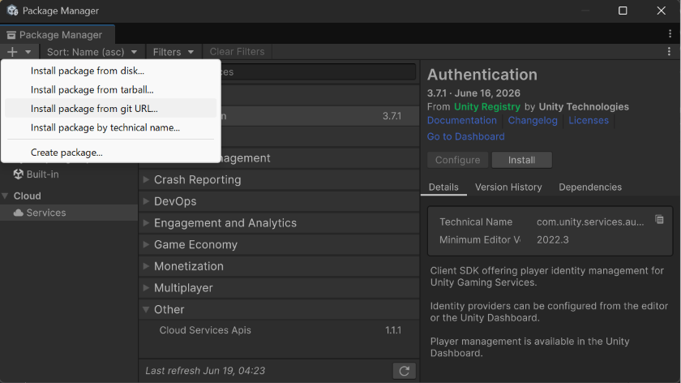
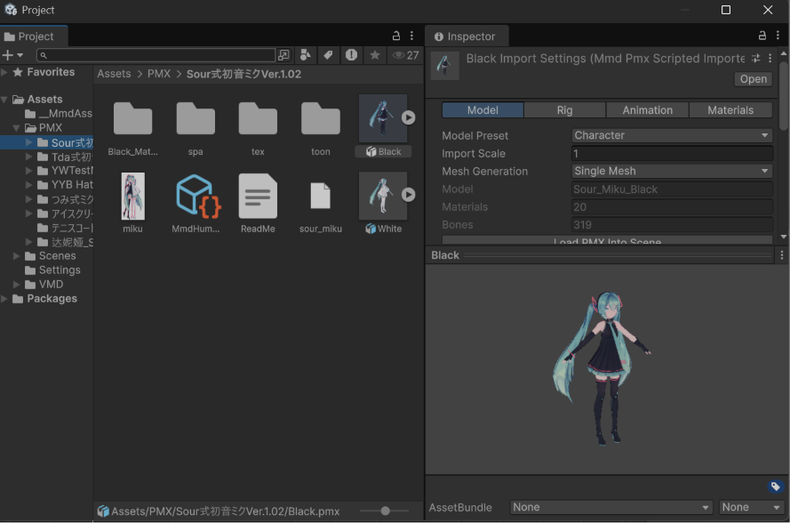
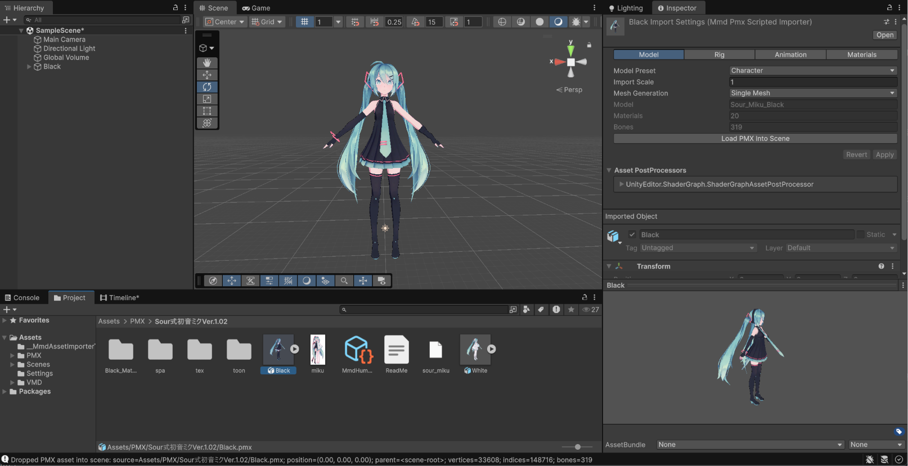
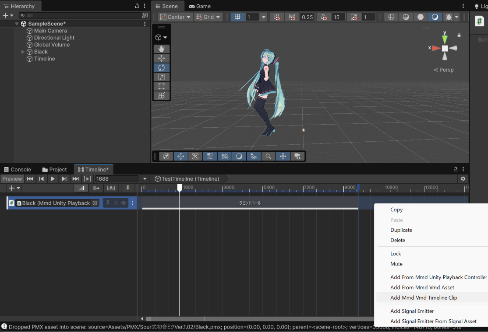
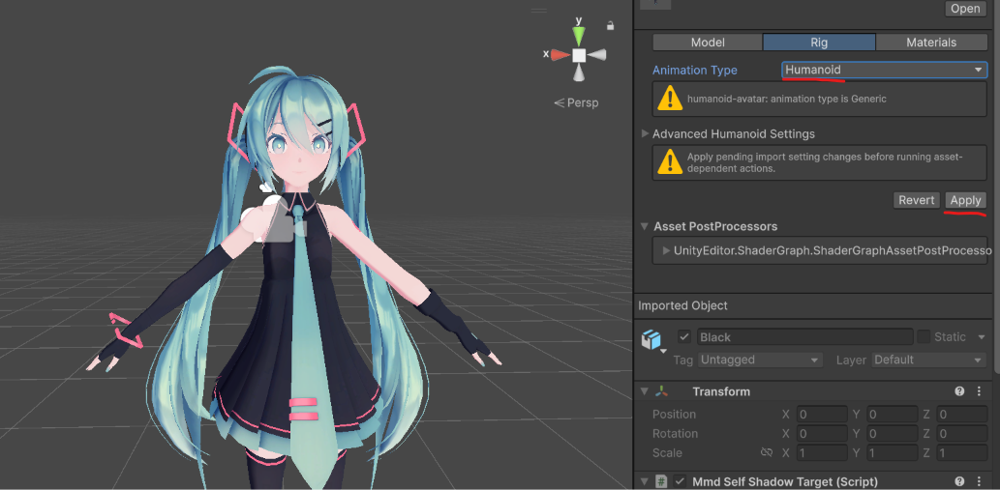
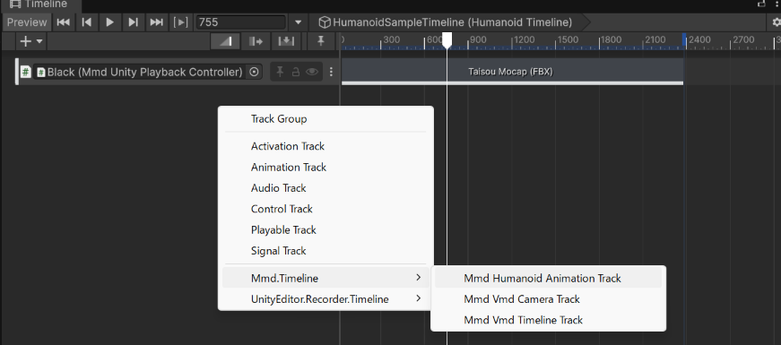
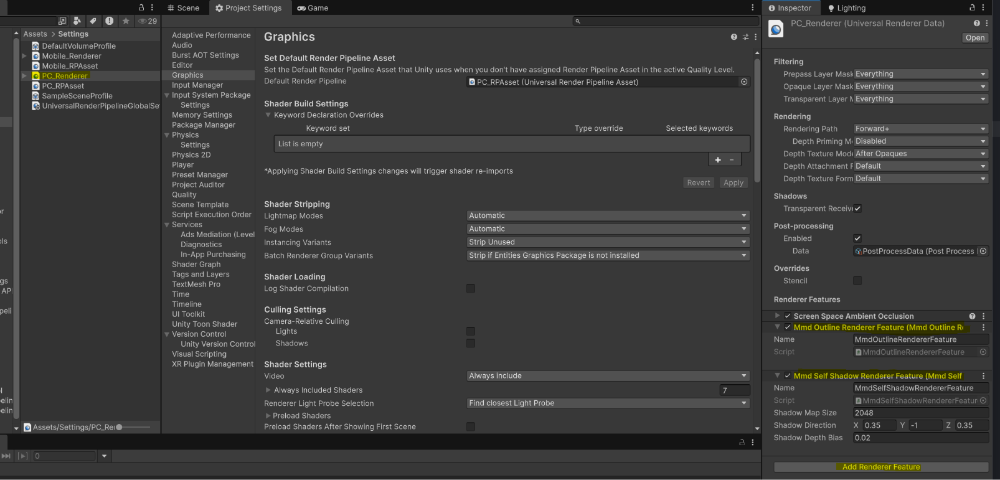
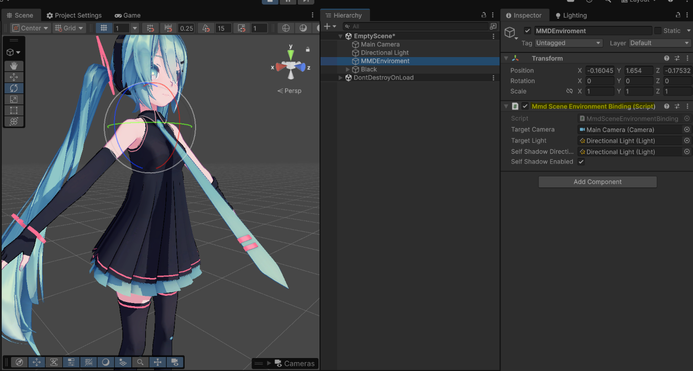
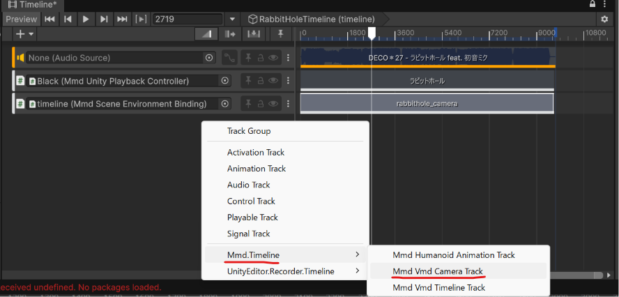

# MMD Loader の使い方

このガイドは、UnityプロジェクトにUPMパッケージ `com.yohawing.mmd-loader` を追加した方向けです。

## 目次

- [インストール](#インストール)
- [PMXを読み込む](#pmxを読み込む)
- [Sceneに配置する](#sceneに配置する)
- [VMDを読み込む](#vmdを読み込む)
- [自動ワーカー再生でモデルを再生する](#自動ワーカー再生でモデルを再生する)
- [Humanoidを設定する](#humanoidを設定する)
- [URPの描画を設定する](#urpの描画を設定する)
- [カメラとライトのモーションを設定する](#カメラとライトのモーションを設定する)
- [クレジット](#クレジット)

## インストール



Unityで **Window > Package Manager** を開きます。**Add package from git URL** に、次のURLを入力してください。

```text
https://github.com/yohawing/unity-mmd-loader.git?path=packages/com.yohawing.mmd-loader
```

対応環境は、Windows x86_64、Unity 6000.0 LTS以降、URP 17です。

## PMXを読み込む



`.pmx` ファイルと、そのモデルが使うテクスチャファイルをUnityプロジェクトの `Assets/` フォルダーに入れます。

PMXはFBXと同じように、モデルファイルとして読み込まれます。読み込み設定はInspectorで変更できます。

## Sceneに配置する



Projectウィンドウから、PMXアセットをSceneまたはHierarchyへドラッグします。

Sceneに再生用のオブジェクトが作られます。PMXだけを配置した場合も再生コントローラーは残るため、あとからTimelineへVMDを追加できます。

## VMDを読み込む



`.vmd` ファイルをUnityプロジェクトの `Assets/` フォルダーに入れます。

読み込んだVMDアセットは、Timelineクリップやランタイム再生から参照します。通常の使い方では、元のVMDデータを複製した別アセットを作る必要はありません。

SceneにあるMMD再生オブジェクトをTimelineへバインドし、VMD用のTimelineクリップを作成します。

エディター上の操作名はパッケージのバージョンによって変わる場合がありますが、基本的な仕組みは次のとおりです。

- PMXアセットをSceneへ配置すると、再生コントローラーが作られます。
- VMDアセットはTimelineクリップから参照します。
- Timelineクリップは、VMDをすぐにAnimationClipへ変換しません。Timelineの再生時刻をMMDランタイムへ渡して、その時刻のポーズを計算します。

## 自動ワーカー再生でモデルを再生する

ネイティブ再生は、対象モデルが1体でも長寿命ワーカーを自動で使います。ワーカー用コンポーネントやコントローラー一覧の設定は不要です。

1. Scene内の各再生コントローラーへ、PMXアセットとVMDアセットを設定します。
2. 各コントローラーで**Physics Mode Off**または**Physics Mode Live**を選びます。
3. **Play On Start**を有効にし、Play Modeへ入ります。

対象となるコントローラーは、どの結果も待たずにすべての評価を開始します。完了したポーズは通常の`Update`コールバックより前にメインスレッドで反映されます。Unityオブジェクトの操作をメインスレッドに保ったまま、複数モデルを並列評価できます。コントローラーごとに異なるフレームレートや物理モードを使用できます。

通常のVMD Timelineクリップも、**Physics Mode Off**では同じ自動ワーカー経路を使います。同じフレームで評価される複数トラックや複数のPlayable Directorをまとめて開始し、`LateUpdate`より前に反映します。TimelineのLive PhysicsとHumanoidリターゲット入力は、従来どおり同期互換経路で評価します。

1体でもワーカーを使うため、従来の1体用同期経路より処理コストが増える場合があります。その代わり、1体用と複数体用の設定は分かれません。ネイティブワーカーを準備できない場合、単体再生は同期経路を使います。ワーカーの実行に失敗した場合は、そのコントローラーだけを停止して警告を出します。PMX/VMDソースの再設定、コントローラーの再構成、fast runtimeの明示的な再有効化、またはコンポーネントの再有効化で再試行します。

## Humanoidを設定する

MMDモーションをUnity標準のHumanoidリグへリターゲットします。

**1. PMXのRigをHumanoidに設定してApplyし、Sceneへ配置します。**



PMX Import Settingsの **Rig** タブを開きます。**Animation Type** を **Humanoid** に変更して、**Apply** を押します。そのあと、PMXをSceneへドラッグします。

**2. TimelineにMMD Humanoid Animation Trackを追加して、再生コントローラーをバインドします。**



Timelineへ **MMD Humanoid Animation Track** を追加し、Sceneにある `MmdUnityPlaybackController` をバインドします。

> **注意:** 複雑なリグには対応していません。腕IKなどに強く依存するモデルでは、正しいポーズにリターゲットできない場合があります。

## URPの描画を設定する

MMD LoaderはURPプロジェクトで使うことを前提としています。複数のURP Assetや品質レベルを使っている場合は、Game Viewやビルドで実際に使われるRenderer Dataを確認してください。



1. **Project Settings > Graphics** を開き、使用中のURP Assetを確認します。
2. そのURP Assetが参照しているRenderer Dataアセットを開きます。
3. Renderer Featuresの一覧へ **MmdSelfShadowRendererFeature** を追加します。
4. 追加した機能を有効にします。最初は、シャドウマップサイズとバイアスを初期値のまま使えます。
5. 複数のRenderer Dataを使う場合は、MMDのSceneを描画するすべてのRendererへ同じ機能を追加します。

## カメラとライトのモーションを設定する

VMDのカメラとライトのモーションは、専用のTimelineトラックで再生します。

**1. `MmdSceneEnvironmentBinding` に、操作するCameraとLightを設定します。**



Scene内のGameObjectへ `MmdSceneEnvironmentBinding` を追加します。**Target Camera** と **Target Light** に、操作したいCameraとLightを設定します。

**2. MMD VMD Camera Trackを追加し、カメラ用VMDを設定します。**



Timelineへ **MMD VMD Camera Track** を追加し、`MmdSceneEnvironmentBinding` をバインドします。次にクリップを追加して、カメラモーションを含む **VMD Asset** を設定します。VMDに含まれるカメラ、ライト、セルフシャドウのキーフレームが、設定した対象へ反映されます。

## クレジット

- モデル: [Sour](https://bowlroll.net/file/146103)
- モーション: [mobiusP](https://www.nicovideo.jp/watch/sm42576784)
