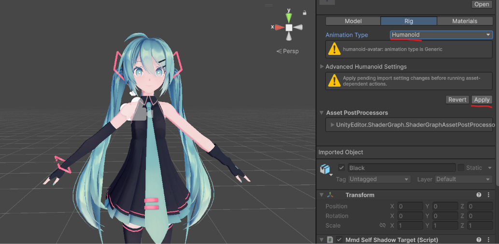
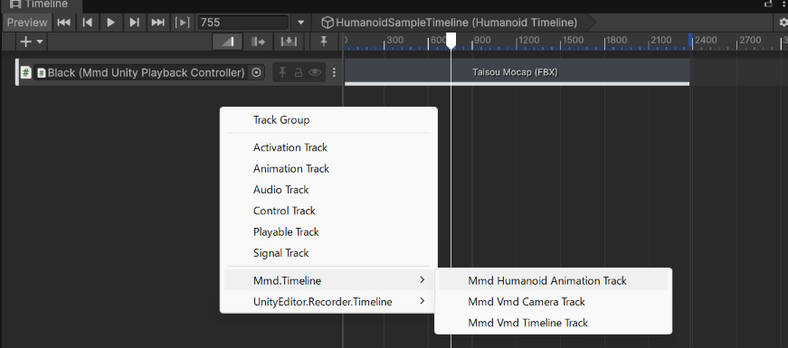
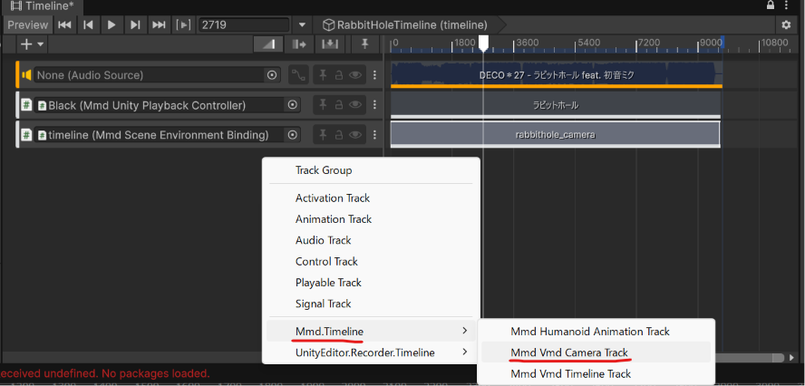

# How to use MMD Loader

This guide is for users who have added `com.yohawing.mmd-loader` to a Unity project as a UPM package.

## Contents

- [How To Install](#add-the-package)
- [Import a PMX](#import-a-pmx)
- [Place it in the Scene](#place-it-in-the-scene)
- [Import a VMD](#import-a-vmd)
- [Set up Humanoid](#set-up-humanoid)
- [Set up rendering in URP](#set-up-rendering-in-urp)
- [Set up the Camera / Light Motion](#set-up-the-camera--light-motion)
- [Credits](#credits)

## How To Install


Open **Window > Package Manager** in Unity, and enter the following into **Add package from git URL**.

```text
https://github.com/yohawing/unity-mmd-loader.git?path=packages/com.yohawing.mmd-loader
```

The release target is Unity 6000.4 with URP 17 on Windows x86_64.

## Import a PMX


Add a `.pmx` file, along with its texture files, under your Unity project's `Assets/` folder.

A PMX is imported as a model file, just like an FBX. You can adjust the import settings in the Inspector.

## Place it in the Scene


Drag the PMX asset from the Project window into the Scene or Hierarchy.

This creates a playback object in the scene. Even when only a PMX is placed, the playback controller is kept, so you can add a VMD to the Timeline later.

## Import a VMD


Add a `.vmd` file under your Unity project's `Assets/` folder.

A VMD asset is referenced by Timeline clips and by the runtime playback source. It is not designed so that you create a separate, duplicated asset from the original VMD data through the normal workflow.

Bind the scene's MMD playback object to the Timeline and create a VMD Timeline clip.

The available editor actions may change between package versions, but the basic idea is as follows.

- A PMX asset creates the scene's playback controller.
- A VMD asset is referenced from a Timeline clip.
- A Timeline clip does not bake the VMD into an AnimationClip right away; it passes the playback time to MMD's runtime evaluation.

## Set up Humanoid

Retarget the motion onto a standard Unity Humanoid rig.

**1. Set the PMX Rig to Humanoid, Apply, then place it in the Scene.**



In the PMX Import Settings, open the **Rig** tab, set **Animation Type** to **Humanoid**, and click **Apply**. Then drag the PMX into the Scene.

**2. Add an MMD Humanoid Animation Track to the Timeline and bind it.**



Add an **MMD Humanoid Animation Track** and bind it to the scene's `MmdUnityPlaybackController`.

> **Note:** Complex rigs are not supported. Models that rely on arm IK and similar setups will not retarget to a correct pose.

## Set up rendering in URP

MMD Loader expects a URP project. If your project uses multiple URP assets or quality levels, check the Renderer Data that is actually used by the Game View or build target.


1. Open **Project Settings > Graphics** and confirm the active URP Asset.
2. Open the Renderer Data asset referenced by that URP Asset.
3. Add **MmdSelfShadowRendererFeature** to the Renderer Features list.
4. Keep the feature enabled. The default shadow map size and bias are intended to be usable as a first setup.
5. If you use multiple Renderer Data assets, add the feature to each renderer that can render the MMD scene.

## Set up the Camera / Light Motion

Play the VMD camera and light motion on its own Timeline lane.

**1. Bind the target Camera and Light to `MmdSceneEnvironmentBinding`.**


Add `MmdSceneEnvironmentBinding` to a scene GameObject, then assign **Target Camera** and **Target Light**.

**2. Add an MMD VMD Camera Track and drive it with a camera VMD.**



Add an **MMD VMD Camera Track** to the Timeline, bind it to the `MmdSceneEnvironmentBinding`, then add a clip and assign the camera **VMD Asset**. Its camera, light, and self-shadow keyframes drive the assigned targets.

## Credits

- Model: [Sour](https://bowlroll.net/file/146103) 
- Motion: [mobiusP](https://www.nicovideo.jp/watch/sm42576784)
