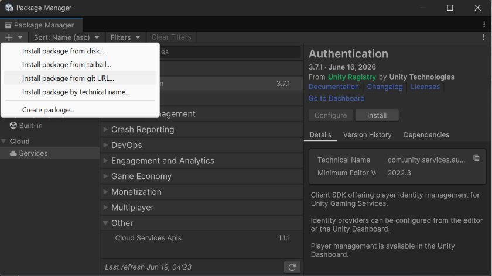
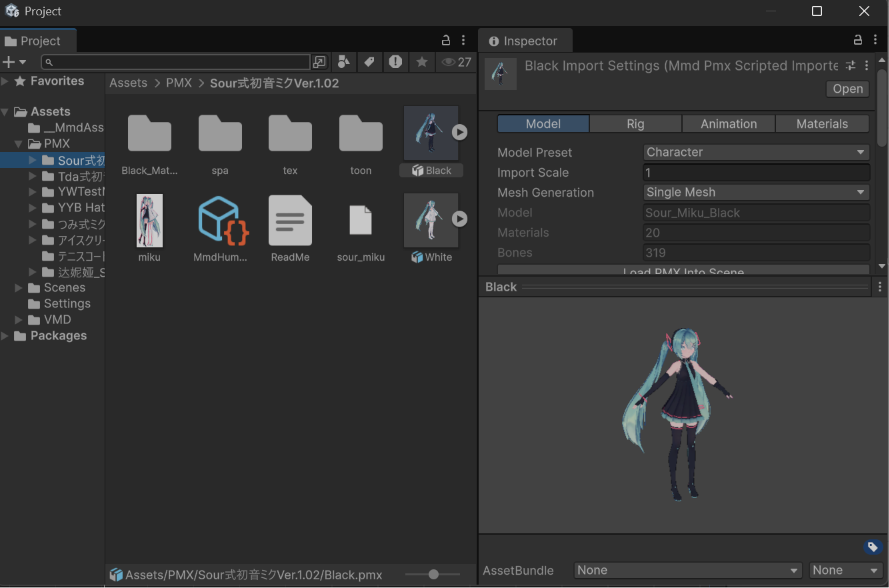
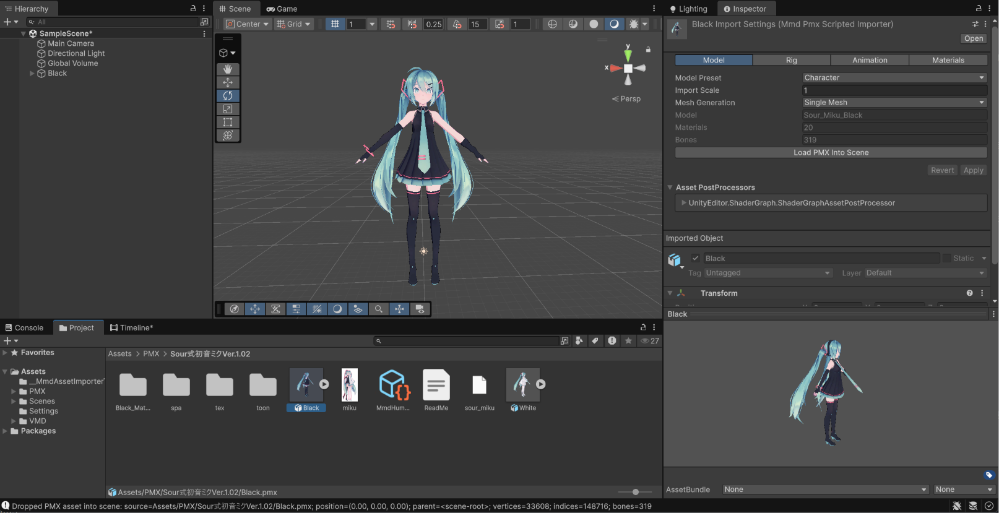
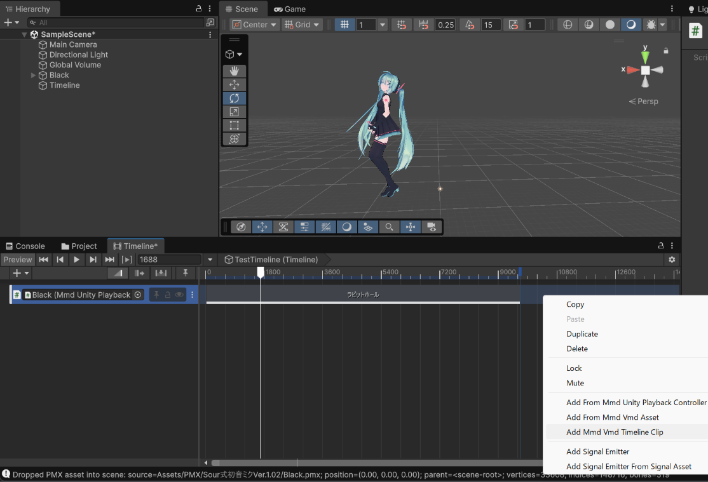
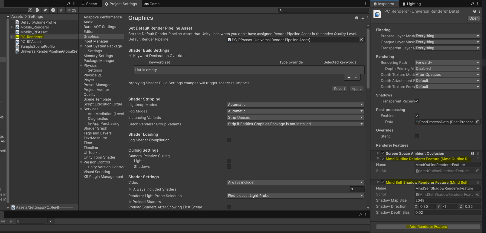
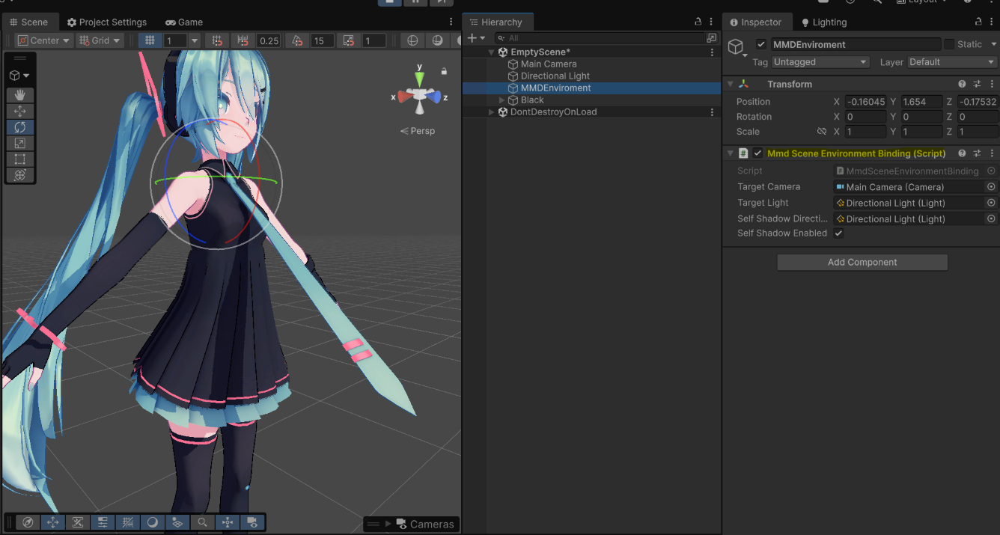

# How to use MMD Loader

This guide is for users who have added `com.yohawing.mmd-loader` to a Unity project as a UPM package.

## 1. Add the package



Open **Window > Package Manager** in Unity, and enter the following into **Add package from git URL**.

```text
https://github.com/yohawing/unity-mmd-loader.git?path=packages/com.yohawing.mmd-loader
```

The release target is Unity 6000.4 with URP 17 on Windows x86_64.

## 2. Optional: import the Basic Playback sample

In Package Manager, open the MMD Loader package and import the **Basic Playback** sample from the **Samples** section.

The sample includes a small redistributable PMX/VMD pair that is useful for checking the release golden path before using third-party MMD assets.

## 3. Import a PMX



Add a `.pmx` file, along with its texture files, under your Unity project's `Assets/` folder.

A PMX is imported as a model file, just like an FBX. You can adjust the import settings in the Inspector.

## 4. Place it in the Scene



Drag the PMX asset from the Project window into the Scene or Hierarchy.

This creates a playback object in the scene. Even when only a PMX is placed, the playback controller is kept, so you can add a VMD to the Timeline later.

## 5. Import a VMD



Add a `.vmd` file under your Unity project's `Assets/` folder.

A VMD asset is referenced by Timeline clips and by the runtime playback source. It is not designed so that you create a separate, duplicated asset from the original VMD data through the normal workflow.

Bind the scene's MMD playback object to the Timeline and create a VMD Timeline clip.

The available editor actions may change between package versions, but the basic idea is as follows.

- A PMX asset creates the scene's playback controller.
- A VMD asset is referenced from a Timeline clip.
- A Timeline clip does not bake the VMD into an AnimationClip right away; it passes the playback time to MMD's runtime evaluation.

## 6. Set up rendering in URP

MMD Loader expects a URP project. If your project uses multiple URP assets or quality levels, check the Renderer Data that is actually used by the Game View or build target.



1. Open **Project Settings > Graphics** and confirm the active URP Asset.
2. Open the Renderer Data asset referenced by that URP Asset.
3. Add **MmdSelfShadowRendererFeature** to the Renderer Features list.
4. Keep the feature enabled. The default shadow map size and bias are intended to be usable as a first setup.
5. If you use multiple Renderer Data assets, add the feature to each renderer that can render the MMD scene.

The PMX importer generates materials for the `MMD Basic URP Toon` shader. Self-shadow rendering requires those generated materials, because they include the dedicated MMD self-shadow caster pass. If you replace materials manually, make sure the replacement shader is intended for this package's MMD rendering path.

### Self-shadow troubleshooting

If the model renders but MMD self-shadow does not appear, check these items in order:

1. Confirm that **MmdSelfShadowRendererFeature** is added to the Renderer Data that is actually used by the current URP Asset and Quality level. If multiple Renderer Data assets exist, the feature must be on the one rendering the MMD scene.
2. Confirm that the placed PMX still uses generated `MMD Basic URP Toon` materials. Replaced materials need a `MmdSelfShadowCaster` pass, otherwise the render pass reports `NoCasterPass`.
3. Confirm that the scene contains one active `MmdSceneEnvironmentBinding`. Multiple active bindings can make the hidden self-shadow target report `AmbiguousEnvironment`.
4. Confirm that **Self Shadow Enabled** is on in `MmdSceneEnvironmentBinding`. The binding records VMD self-shadow state as MMD render state; it does not change Unity `Light.shadows`, `RenderSettings`, or `QualitySettings.shadowDistance`.
5. Treat binding-local `Active` as "self-shadow state was recorded", not as proof that the shadow map rendered. Target readiness, RendererFeature setup, bounds, and caster passes must also be valid.
6. If there is no VMD self-shadow track, the binding uses a default MMD self-shadow state. If the VMD self-shadow mode disables shadows, the diagnostic state is `ModeDisabled`.
7. If the character has no visible renderer bounds, the render pass reports `NoBounds`. Check that the placed PMX hierarchy is active and visible.

For the diagnostic layer definitions, see `docs/MMD_SELF_SHADOW.md`.

## 7. Set up the Scene environment

The scene needs the playback object from the PMX placement step and a scene environment binding for camera, light, and self-shadow state.




1. Place the PMX in the Scene so the MMD playback object and `MmdUnityPlaybackController` exist.
2. Add `MmdSceneEnvironmentBinding` to a scene GameObject. A small empty GameObject such as `MMD Scene Environment` is fine.
3. Assign **Target Camera** to the Camera that VMD camera motion should drive.
4. Assign **Target Light** to a Directional Light if the VMD light track should drive scene light color and direction.

## 8. Optional: bake a Humanoid AnimationClip

Use this workflow when the motion must become a standard Unity Humanoid `AnimationClip` for an Animator or Humanoid Timeline track. Native MMD playback remains the default path and does not require this conversion.

### Prepare the PMX as Humanoid

1. Select the imported PMX asset and open the **Rig** tab in its Import Settings.
2. Set **Animation Type** to **Humanoid**, then choose **Apply** so Unity reimports the PMX.
3. Confirm that no Avatar creation warning remains. A successful import adds a valid Humanoid Avatar sub-asset; success is intentionally quiet in the normal Inspector.
4. If a warning remains, open **Advanced Humanoid Settings** and check required-bone mapping conflicts or missing bones. Helper and IK bones are not mapped as Humanoid body bones.

### Create the setup asset

1. Select the imported PMX asset itself, not a Scene instance.
2. Click **Create Humanoid Setup Asset** in the PMX asset Inspector.
3. Select the generated `MmdHumanoidSetupAsset` and confirm **Mapping Readiness** is `Ready`. Expand **Mapping Entries** only when a mapping needs inspection.
4. **Create Hidden Proxy Rig** and **Create Proxy Rig and Build Avatar** are diagnostics/inspection actions. They are not prerequisites for clip bake and do not assign an Avatar to an Animator.

### Bake the clip

1. In **Humanoid Clip Conversion**, assign the imported **VMD Asset**.
2. Set **Frame Rate** to the intended source rate, normally `30` for VMD.
3. Set **Start Frame** to `0` or the first frame to keep. Leave **End Frame** at `-1` to use the VMD maximum frame, or enter an inclusive end frame.
4. Confirm **Status** reports that prerequisites are ready, then click **Create Humanoid AnimationClip Asset**.
5. The generated `.anim` is saved beside the setup asset with a unique name and selected in the Project window. The writer emits Humanoid muscle curves, so `AnimationClip.humanMotion` is true and the clip can retarget through a valid Humanoid Avatar.

### Play the generated clip

For a normal Animator, create or open an Animator Controller, use the generated `.anim` as a state motion, and assign the controller to an Animator with a valid Humanoid Avatar.

For Timeline:

1. Add an **MmdHumanoidAnimationTrack** to the Timeline.
2. Bind the track to the placed object's `MmdUnityPlaybackController`.
3. Add an **MmdHumanoidAnimationClip**, assign the generated `.anim`, and assign its **Proxy Animator** to the Animator on the same playback object.
4. Scrub in Edit Mode or play forward in Play Mode. The track retargets the proxy Humanoid pose back onto the MMD hierarchy.

### Humanoid conversion boundaries

- The generated clip contains mapped Humanoid muscle rotation curves. It is not a copy of the native PMX hierarchy and does not preserve every MMD helper, IK, append, finger, or facial behavior exactly.
- The current writer does not bake center/root translation as an independent root-motion curve. Treat root travel as a separate quality check instead of assuming native MMD displacement is preserved.
- Live physics is never baked into the clip. Use native Play Mode playback for hair/skirt physics, or add a separate post-animation physics workflow.
- Frame times are local to the requested range: the selected Start Frame becomes clip time `0`.
- Re-running bake creates a unique `.anim`; it does not overwrite an existing clip silently.

### Humanoid bake troubleshooting

| Status/problem | Check |
| --- | --- |
| Avatar warning after Apply | The PMX needs the required hips/spine/head/arm/leg mappings without ambiguity. Review Advanced Humanoid Settings and reimport. |
| **Mapping Readiness** is not `Ready` | Ensure the setup asset references the same PMX, the imported hierarchy and SkinnedMeshRenderer are ready, and required mappings are present. Recreate the setup asset after PMX Rig changes if necessary. |
| Bake button is disabled | Assign a VMD and resolve the prerequisite issues listed above **Status**. |
| Clicking bake logs a validation failure | Use a positive finite Frame Rate, keep Start Frame non-negative, and keep the inclusive End Frame between Start Frame and the VMD maximum. |
| Generated clip does not animate an Animator | Confirm the target Animator has a valid Humanoid Avatar and the clip reports `humanMotion`. Generic or Legacy targets cannot consume Humanoid muscle curves correctly. |
| Timeline clip produces no pose | Bind `MmdHumanoidAnimationTrack` to the playback controller and set the clip's Proxy Animator to the Animator on that controller object. |
| Pose differs from native MMD playback | Check mapping, bind pose, left/right limbs, foot contact, and root travel. Live physics and MMD-only helper behavior are outside the baked clip contract. |

## Credits

- Model: [Sour](https://bowlroll.net/file/146103) 
- Motion: [mobiusP](https://www.nicovideo.jp/watch/sm42576784)
