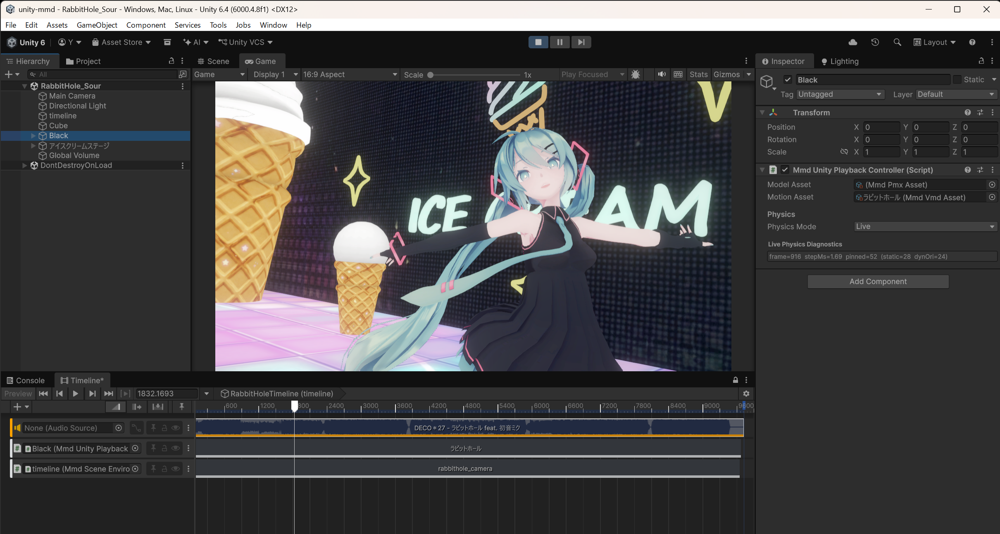

# unity-mmd-loader



> クレジット — モデル: [Sour](https://bowlroll.net/file/146103) ／ モーション: [mobiusP](https://www.nicovideo.jp/watch/sm42576784) ／ カメラモーション: [koko](https://bowlroll.net/file/305434) ／ 背景: [とじる](https://seiga.nicovideo.jp/seiga/im11796453)

PMXモデルとVMDモーションを通常のUnityアセットとしてインポートし、Sceneへ配置してTimelineから再生するためのパッケージです。現在はUnity 6000.4 URP／Windows x86_64向け`v0.1.3`リリース候補です。

[English](../README.md) / [詳しい使い方](./HOW_TO_USE.md)

## クイックスタート

1. パッケージを導入し、Package Managerから`Basic Playback` sampleをインポートします。
2. `.pmx`と参照テクスチャをインポートし、PMXアセットをSceneまたはHierarchyへドラッグします。
3. `.vmd`をインポートし、配置した再生オブジェクトへbindした`MmdVmdTimelineTrack`に追加します。
4. Edit ModeではTimelineをスクラブしてanimation-only previewを確認します。編集中の物理は意図的にoffです。
5. Play Modeに入り、Timelineをforward再生するとLive physicsが動作します。
6. Unity Humanoid clipが必要な場合はPMX RigをHumanoidに設定し、Humanoid Setup Assetから明示的にclipを生成します。

sampleには再配布可能なPMX/VMDが含まれます。作成手順とトラブルシューティングは[詳しい使い方](./HOW_TO_USE.md)を参照してください。

## 要件と対応状況

| 項目 | 現在の対応 |
| --- | --- |
| Unity | Unity 6000.4、Windows x86_64、Universal Render Pipeline 17 |
| モデル | PMXのインポートとScene配置。PMDは非対応 |
| モーション | VMD import、native `mmd-anim`評価、Timeline scrub/playback、cameraとDirectional Light motion |
| モーフ | 頂点/BlendShape、UV、材質、ボーン、グループ、flipなど対応済みruntime morph評価 |
| 物理 | Play Mode forward playbackでLive physics。Edit Mode scrubとrandom accessはphysics-off |
| レンダリング | URP MMD Toon／URP Lit preset、texture、outline、透明material order、optional SelfShadow |
| Humanoid | Rig mappingとAvatar import、明示的なHumanoid Setup Asset／AnimationClip bake |

## Runtime Verification sample

`Runtime Verification`は、local asset用のstandalone viewer兼CLI検証playerです。PMX/VMD load、seek/playback、camera VMD、audio/background参照を確認し、JSONやscreenshot artifactを生成できます。通常のUnity authoring導線ではなくdiagnostics用であり、ライセンス付きlocal assetはrepository外に保持します。

## 既知の制限

- 重なったVMD clipは決定的なsingle-winner hard cutです。weighted pose blendは提供しません。
- PMD importとmacOS/Linux向けnative binary同梱は未対応です。
- Edit Mode Timeline scrubではLive physicsを評価せず、Humanoid AnimationClipにもLive physicsをbakeしません。
- cameraはdocumented VMD camera path、lightはDirectional Lightがrelease対象です。未対応projection/lightはnot-ready diagnosticsになります。
- SelfShadowはURP RendererFeatureの明示設定が必要です。MMD/ray-mmdとの完全なvisual parityは保証しません。
- raw path runtime loadはdiagnostics用です。通常のauthoringはimport済みPMX/VMDを使います。

## インストール

Unity Package Managerの **Add package from git URL** に以下を指定します。

```text
https://github.com/yohawing/unity-mmd-loader.git?path=packages/com.yohawing.mmd-loader
```

## ライセンス境界

このrepositoryは第三者のPMX、VMD、texture、motion、audio、capture assetを再配布しません。各assetの利用規約と再配布条件を確認してください。local verification assetと生成artifactはcommitしないでください。
